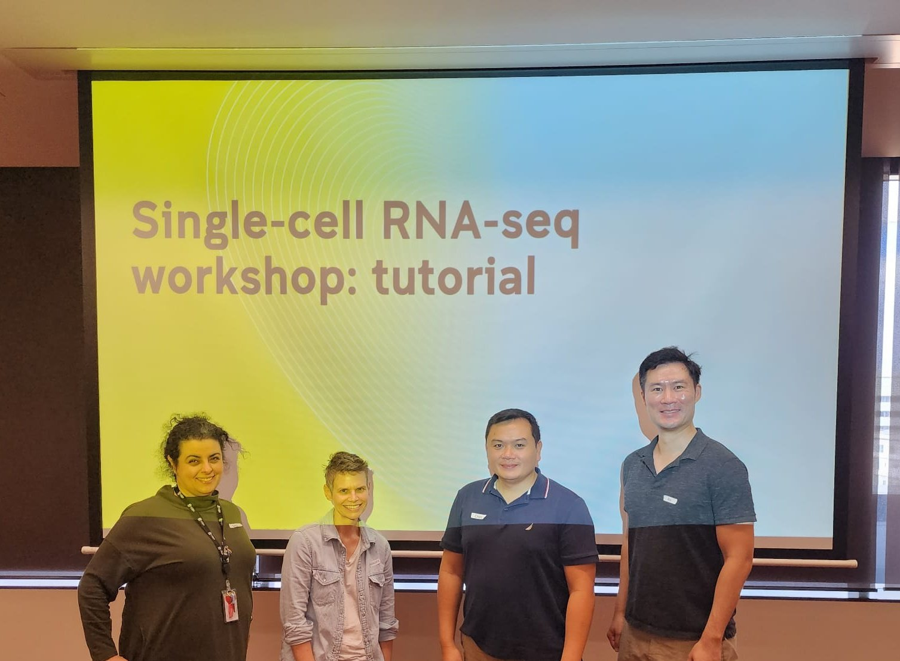

---

---

Previous and upcoming events hosted by our team.

<head>
<meta charset="UTF-8">
<meta name="viewport" content="width=device-width, initial-scale=1.0">
<title>Event Display</title>

</head>
<body>

  

    

      <h3>2023</h3>
    

    

      
 Single-cell analysis workshop.   Level 6 Wallace Wurth Building, UNSW.   Contact: Sara Ballouz and Raymond Louie

    

    

      
    

  

  <!-- Add more events here -->

</body>

