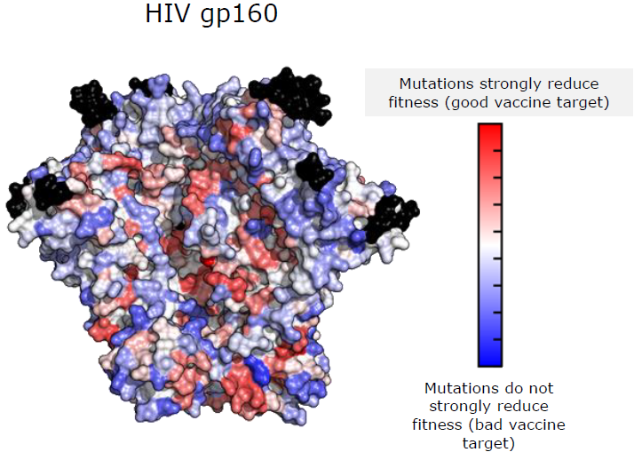

---

---

<h3>Rational vaccine design using computational models</h3> 

Description of topic
 

<h4> Representative publications</h4>

- Journal 1
- Journal 2

<h4> More information</h4>

Honors and postgraduate opportunities are available. Please contact [Raymond Louie](mailto:r.louie@unsw.edu.au).

	

